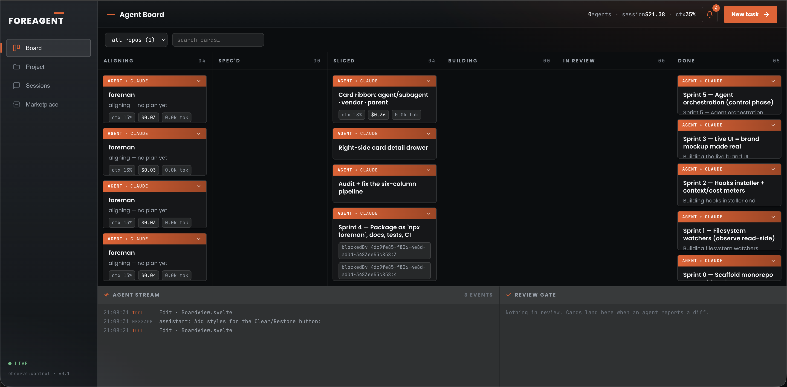

# FOREAGENT

**Observe → control orchestrator for AI coding agents.** A local-first kanban board
that watches your Claude Code / Codex / Gemini sessions, shows live context-budget and
cost meters, and — when you're ready — spawns, runs, and reviews agents itself.



---

## Quick start

Get it running in three commands. You need **Node 20+** and **[bun](https://bun.sh)**
(bun runs the local server in dev).

```bash
git clone https://github.com/katimjabi-star/katim_foreagent.git
cd katim_foreagent
bun install
bun run dev
```

Then open **http://localhost:5173**. That's it — the board comes up and starts
reflecting whatever agents are already running on your machine.

> Don't have bun? Install it once: `curl -fsSL https://bun.sh/install | bash`

### Try it without any real agent data

```bash
FOREMAN_DEMO=1 bun run dev      # seeded demo stream, then open http://localhost:5173
```

### Run on Node only (no bun)

Build the self-contained bundle and serve it with plain Node:

```bash
npm install
npm run build
FOREMAN_WEB_DIST=apps/web/dist node bin/dist/server.mjs   # open http://localhost:3777
```

### What you need for each mode

| Mode | Requires |
| --- | --- |
| **Observe** (live board of running sessions) | nothing extra — it reads Claude Code's on-disk state |
| **Control** (spawn/run/review agents) | at least one agent CLI on your `PATH`: `claude`, `codex`, or `gemini` |

The **New task** screen detects which of those CLIs are actually installed and only lets
you run with the ones it finds.

---

## Why

Coding agents are fast and increasingly autonomous, but you fly them blind: which
session is burning context, which one is stuck waiting on you, what each one changed,
and how much it all cost. FOREAGENT is the cockpit. It has two gears:

- **Observe (default).** Zero-touch. It reads Claude Code's on-disk state and renders a
  live board: tasks, the tools each session is running, and per-session **context %**,
  **token**, and **$ cost** meters derived straight from the transcript. Nothing to
  install into your sessions.
- **Control (opt-in).** Spawn an agent against a repo from the board. It runs
  autonomously in an **isolated git worktree** on a `foreman/…` branch, then lands in
  the **In Review** column with a diff for you to approve or send back. A bad run is a
  throwaway branch — never a mutation of your working tree.

## The board

Six columns model the SDLC pipeline an agent moves work through:

`Aligning → Spec'd → Sliced → Building → In Review → Done`

Claude Code's TodoWrite states map in automatically (`pending → Sliced`,
`in_progress → Building`, `completed → Done`); the richer states fill in from hooks and
the control plane.

### Context-budget meters — the point

Every card under an active session shows a live meter built from the `usage` block Claude
Code records on each turn — **no API calls, no hooks required**:

- **context %** of the model's window (1M for Opus / Sonnet / Fable, 200K for Haiku). Past
  **40%** — HumanLayer's "dumb zone" — the card glows amber so you compact before quality
  degrades.
- **$ cost**, accumulated per session at current model rates (cache reads at 0.1×, cache
  writes at 1.25×).
- **tokens in**, cache read, model.

## New task — the intake console

The **New task** button opens a loop-engineered intake that makes the run target
unmissable *before* a single line is generated:

- **Context card** — the folder (absolute path), project, git **branch** the worktree
  forks from, the **model** that will run, the detected **stack**, which **policy**
  files the repo carries (`CLAUDE.md`, `AGENTS.md`, `GEMINI.md`, …), and the **MCP
  servers** available to the run.
- **Vendor picker, gated on installs** — Claude Code / Codex / Gemini are listed, but only
  the CLIs actually found on your `PATH` are selectable (with the resolved path + version).
- **MCP awareness, per vendor & scope** — the card shows which Model Context Protocol
  servers the selected vendor can use, tagged **local** (this repo) vs **global** (all
  repos), read from that vendor's own config (`~/.claude.json` + `.mcp.json`,
  `~/.codex/config.toml`, `~/.gemini/settings.json`). Switching vendor re-scans, because
  an MCP wired into Claude isn't visible to Codex.
- **Model picker** — per-vendor model lists (see the table below), defaulting to each
  vendor's flagship.
- **Brief tools** — one-click spelling/grammar **Refine** (via `claude -p`), PRD/spec
  **document upload**, and a voice-input affordance (UI only for now).
- **Skills & subagents** — installed Claude Code skills and the repo's `.claude/agents`
  are surfaced and folded into the agent's harness prompt, with AI-suggested picks.

## Optional: richer status via hooks

The baseline board needs nothing installed. For subagent / idle / *waiting-on-you*
signals, install FOREAGENT's Claude Code hooks:

```bash
npx foreman --install     # back up settings.json, merge hooks non-destructively
npx foreman --uninstall   # remove only FOREAGENT's entries
```

The hooks are **fail-safe by contract**: they only append a line to a spool file and
**always exit 0** — they can never block, slow, or break a live coding session. The
installer **backs up `settings.json`** before touching it and merges idempotently,
leaving your existing hooks and settings untouched.

## Multi-agent

Claude Code, Codex, and Gemini CLI are first-class. Cards are colour-dotted by vendor,
and the New task dialog lets you pick which agent (and which model) runs a task.
Headless invocations:

| Vendor      | Command                                              |
| ----------- | ---------------------------------------------------- |
| Claude Code | `claude -p <prompt> --permission-mode … --model <id>`|
| Codex       | `codex exec --full-auto --model <id> <prompt>`       |
| Gemini CLI  | `gemini -p <prompt> -y -m <id>`                      |

Point FOREAGENT at a custom binary with `FOREMAN_CLAUDE_CODE_BIN`, `FOREMAN_CODEX_BIN`,
`FOREMAN_GEMINI_CLI_BIN`.

### Models offered (verified June 2026)

| Vendor      | Models (default first) |
| ----------- | ---------------------- |
| Claude Code | `claude-opus-4-8`, `claude-fable-5`, `claude-opus-4-7`, `claude-sonnet-4-6`, `claude-haiku-4-5` |
| Codex       | `gpt-5.5`, `gpt-5.4`, `gpt-5.4-mini`, `gpt-5.3-codex-spark` |
| Gemini CLI  | `gemini-3-pro-preview`, `gemini-3-flash-preview`, `gemini-2.5-pro`, `gemini-2.5-flash` |

## Architecture

One **event-sourced** spine. Observers (filesystem watchers) and the controller (the
spawn/command bus) both append the *same* events to an append-only JSONL log; the board
is a pure projection of that log. That single decision is why observe and control are one
app, not two — the UI never knows who produced an event.

```
~/.claude/{tasks,projects}  ─┐
hook spool (~/.foreman)      ─┤→ watchers ─┐
spawned agents (worktrees)  ─┘→ control ──┤→ event log (JSONL) → projection → SSE → Svelte board
```

- **No database.** Append-only JSONL + in-memory projection. `bun run dev` just works.
- **Stack.** TypeScript, a `node:http` server with SSE, Svelte 5 SPA. The published
  artifact is a single ~80 KB plain-Node bundle with **zero runtime dependencies** — bun
  is used only for dev/tests.

## Development

```bash
bun install
bun run dev        # server (watchers) + Vite, one Ctrl-C stops both → http://localhost:5173
bun run check      # tsc
bun run test       # vitest
bun run build      # web + self-contained server bundle → bin/dist/server.mjs
FOREMAN_DEMO=1 bun run dev   # seeded demo stream, no real Claude data needed
```

### Layout

```
packages/core   pure domain: event vocabulary, log, projection, parsers, pricing, orchestration, model catalog
apps/server     node:http server, filesystem + hook watchers, control plane, vendor/CLI + MCP detection
apps/web        Svelte 5 board + New task intake console
assets/hooks    the fail-safe hook emitter
bin             npx entry, hook installer, built server bundle
```

## Status

v0.1 — observe is solid and tested; control runs end-to-end (spawn → worktree → diff →
review gate), and the New task intake surfaces folder/project/branch/model/policy with
installed-CLI detection and per-vendor model selection. Branch auto-merge on approve and
the pre-build clarifying-questions loop are the next increments.

## License

MIT
