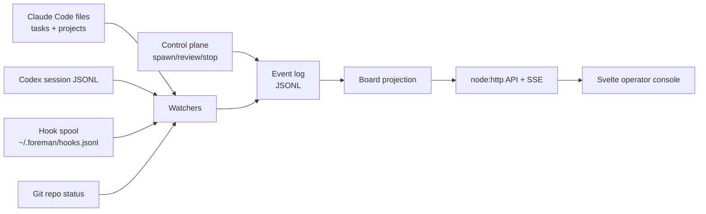
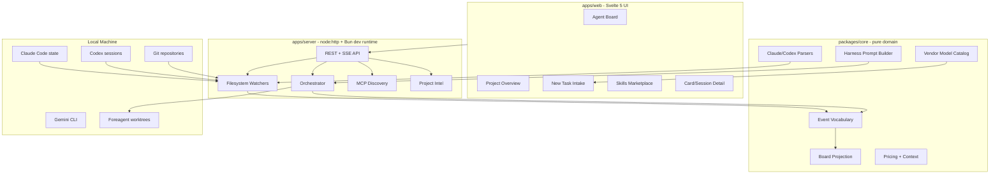
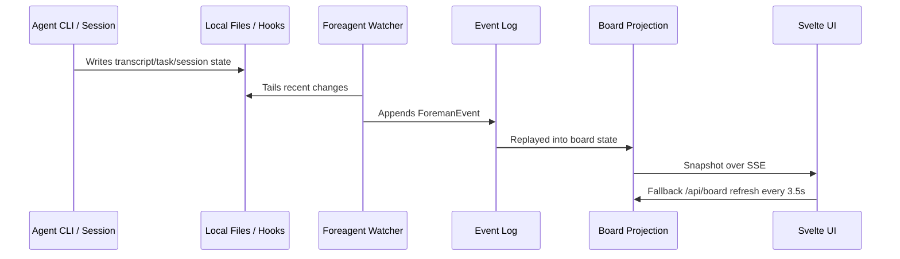
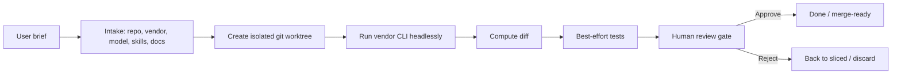
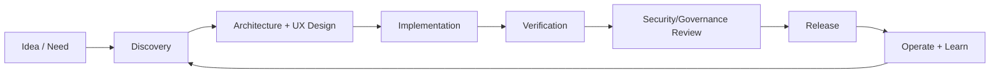
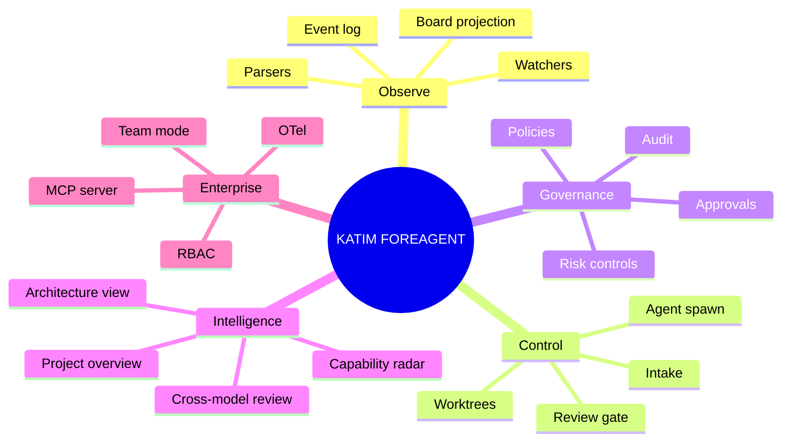

# KATIM FOREAGENT - Project Document

**Document status:** Team-shareable project baseline  
**Project:** KATIM FOREAGENT  
**Version covered:** v0.1 current codebase, with V2/V3 target roadmap  
**Prepared:** June 2026  
**Audience:** Engineering, product, architecture review, delivery leadership, security/governance stakeholders

---

## Diagram Note

The architecture visuals in this document are Mermaid diagrams. They render directly in GitHub, GitLab, many Markdown viewers, and VS Code extensions, and can be exported as SVG/PNG for presentations.

---

## 1. Executive Summary

KATIM FOREAGENT is a local-first operator console for AI coding agents. It observes active Claude Code, Codex, and Gemini-style agent work, converts that activity into a unified event stream, and renders a live SDLC board showing agent status, task movement, tool usage, context budget, cost, branch state, and review readiness.

The product is built for the next operating model of software delivery: **loop engineering**. Instead of manually prompting one agent turn at a time, teams define repeatable loops: discover work, assign it, isolate it, verify it, review it, merge or reject it, and retain memory outside the model context. O'Reilly's June 2026 loop engineering framing identifies the practical loop primitives as automations, worktrees, skills, connectors/MCP, subagents, and persistent state. KATIM FOREAGENT already implements or observes the major pieces of that model.

For an enterprise/MNC environment such as EDGE/KATIM, the value is not "another chatbot." The value is an auditable control room for AI-assisted engineering: work visibility, safe worktree isolation, human checkpoints, cross-model review, vendor-neutral session monitoring, and an architecture ready for governance, OTel export, and MCP interoperability.

---

## 2. Business Objective

### Primary Objective

Create a trusted command-and-control layer for AI coding agents so engineering teams can use autonomous tools without losing visibility, governance, or delivery discipline.

### Why It Matters

Modern coding agents can generate and modify software quickly, but they create operational risk when teams cannot answer:

- Which agent is doing what right now?
- Which repository, branch, and worktree is being changed?
- What tools did the agent run?
- Is the work isolated from the main working tree?
- Which tasks are waiting for human input?
- How much context and budget is being consumed?
- Did tests pass?
- Has an independent model reviewed the diff?
- What should be merged, rejected, or escalated?

KATIM FOREAGENT is designed to answer these questions from one dashboard.

---

## 3. Product Positioning

### Product Name

**KATIM FOREAGENT**

### Product Category

AI agent operator console / local-first multi-agent SDLC control plane.

### Core Position

KATIM FOREAGENT is not the coding agent. It is the **operator console** around coding agents. It observes agent state, standardizes events, manages controlled agent runs, and gives humans a governance-ready checkpoint before code reaches the main line.

### Differentiation

| Area | Typical point tools | KATIM FOREAGENT |
| --- | --- | --- |
| Agent usage | One CLI/session at a time | Multi-vendor board across Claude Code, Codex, Gemini |
| Visibility | Transcript-only or terminal-only | SDLC board + context/cost/tool/status projection |
| Safety | Agent edits current checkout | Isolated git worktrees for controlled runs |
| Review | Human-only or same-model self-review | Review gate with cross-model reviewer support |
| Governance | Manual notes | Event-sourced JSONL audit trail |
| Enterprise fit | Developer utility | Operator console aligned with loop engineering and governance practices |

---

## 4. Current Capability Baseline - v0.1

### Live Board

The board models the SDLC as:

`Aligning -> Spec'd -> Sliced -> Building -> Review -> Done`

Observed task states are mapped into those columns and enriched with live telemetry.

### Vendor Support

Current first-class vendors:

- Claude Code
- Codex
- Gemini CLI

The system detects installed CLIs and exposes vendor/model choices through the New Task intake.

### Observed Data Sources

KATIM FOREAGENT reads live local agent state from:

- `~/.claude/tasks`
- `~/.claude/projects`
- `~/.codex/sessions`
- `~/.foreman/hooks.jsonl`
- Git repository status snapshots

### Control Plane

Controlled agent runs are spawned in isolated git worktrees. On completion, the work is moved into a review gate with diff/test metadata.

### New Task Intake

The intake screen detects:

- Active repo and path
- Branch
- Installed vendor CLIs
- Vendor models
- Skills
- Subagents
- MCP servers per vendor and scope
- Background PRD/spec documents

### Skills Marketplace

Bundled skills:

- `code-reviewer`
- `test-author`
- `api-designer`
- `perf-profiler`

Bundled templates:

- Add a test suite
- Set up CI
- Add a health endpoint
- Write a README
- Dependency audit

Project UI skill reference:

- `assets/skills/foreagent-ui/SKILL.md` defines the KATIM/EDGE-inspired operator-console design language used by the current UI.

### Project Overview

The Project Overview tab now includes:

- Repository identity
- Git state
- Detected languages/frameworks/ecosystems
- Architecture dialog with tabs:
  - Overview
  - Frontend
  - Backend/API
  - Data
- Dependencies and dev dependencies
- AI project summary
- Project Q&A over local CLI auth

---

## 5. Architecture Overview

KATIM FOREAGENT uses an **event-sourced local architecture**. Watchers and controllers append events to a shared JSONL event log. The UI does not need to know whether an event came from observation or a controlled spawn. It only consumes the board projection.

### Key Architectural Decision

Observers and controllers emit the same event vocabulary:

- `task.created`
- `task.updated`
- `task.moved`
- `agent.spawned`
- `agent.status`
- `tool.used`
- `message`
- `context.snapshot`
- `diff.ready`
- `test.run`
- `review.requested`
- `review.ready`
- `git.snapshot`
- `alert`

This is the core decision that keeps the product coherent. It allows observed sessions and controlled sessions to render identically.

---

## 6. Runtime Component Architecture

---

## 7. Data Flow

The fallback board refresh is important for reliability: if SSE reconnects, browser sleep occurs, or git-only projection changes happen without new append events, the UI still reconciles automatically.

---

## 8. Control Plane Flow

The control plane follows a conservative enterprise posture: autonomous execution is acceptable only because the work happens in an isolated worktree and must pass through review.

---

## 9. Technology Stack

### Frontend

- Svelte 5
- Vite
- TypeScript
- Inline SVG icon system
- Project-specific KATIM/EDGE-inspired UI design system

### Backend

- TypeScript
- `node:http`
- Bun for dev/runtime execution of TypeScript server
- Server-Sent Events for live board updates
- JSON endpoints for project, board, context, agents, vendors, skills, MCP, reviews

### Domain/Core

- Pure TypeScript package under `packages/core`
- Event vocabulary
- Projection reducer
- Claude parser
- Codex parser
- Pricing/context utilities
- Orchestration helpers
- Model catalog
- Agent definition parser

### Persistence

- Append-only JSONL event log at `~/.foreman/events.jsonl`
- No database dependency in v0.1
- In-memory projection rebuilt from event log

### Agent Integrations

- Claude Code
- Codex CLI
- Gemini CLI
- MCP configuration discovery
- Claude Code hooks

---

## 10. Enterprise Delivery Model

For MNC-style delivery, KATIM FOREAGENT should be managed as a product platform, not a one-off developer tool.

### Delivery Roles

| Role | Responsibility |
| --- | --- |
| Product Owner | Prioritize operator-console workflows and stakeholder value |
| Engineering Lead | Own architecture, quality gates, technical direction |
| Security Lead | Review tool permissions, worktree isolation, MCP risk, audit requirements |
| QA/Test Lead | Define acceptance, regression, performance and reliability gates |
| DevOps/Platform Lead | Packaging, CI/CD, deployment, host compatibility |
| AI Governance Lead | Align with AI risk and agent governance policies |
| UX Lead | Ensure control-room workflow clarity and low cognitive load |

### Governance Cadence

| Ceremony | Cadence | Output |
| --- | --- | --- |
| Product steering | Monthly | Roadmap, scope, funding decisions |
| Architecture review board | Monthly or per major change | ADRs, security posture, integration approvals |
| Sprint planning | 2 weeks | Sprint backlog and acceptance criteria |
| Technical design review | Per epic | Sequence diagrams, API/event contracts, risk notes |
| Security review | Per release | Threat model, MCP/tool review, permission audit |
| Release readiness | Per release | Test evidence, known issues, rollback plan |

### Stage Gates

---

## 11. Quality and Verification Strategy

### Current Automated Checks

- `npm run check` - TypeScript project check
- `npm test` - Vitest test suite
- `npm run build:web` - production web build
- `npm run build` - full web + server bundle

### Current Test Coverage Areas

- Projection behavior
- Agent parsing
- Claude parsing
- Codex parsing
- Orchestration helpers
- Pricing/context
- Project stack detection
- MCP parsing

### Recommended Quality Gates for V2+

| Gate | Requirement |
| --- | --- |
| Type safety | `npm run check` required |
| Unit tests | `npm test` required |
| Web build | `npm run build:web` required |
| Server bundle | `npm run build:server` required before publish |
| UI smoke | Board, Project Overview, New Task, Live/Demo toggle |
| SSE/reconnect | Browser reconnect and fallback polling verified |
| Security | No shell interpolation for agent command args |
| Worktree safety | No autonomous edits outside isolated worktree |

---

## 12. Security and Risk Management

KATIM FOREAGENT should be treated as an agentic engineering control system. It observes sensitive local code and can launch tools that modify code in isolated worktrees.

### Current Safety Controls

- Local-first operation
- Append-only local event log
- Controlled agent runs use isolated git worktrees
- Vendor commands use discrete argv entries, not shell interpolation
- New Task validates repo path against observed repos
- MCP discovery is read-only
- Hook emitter is designed to be fail-safe and exit successfully
- Review gate before approval

### Enterprise Risk Themes

| Risk | Control |
| --- | --- |
| Agent edits wrong repo | Observed repo allow-list, worktree isolation |
| MCP tool abuse | Vendor/scope visibility, future allow-list and approval workflow |
| Hidden cost/context burn | Context meters and cost projection |
| Bad generated code | Tests, diff review, cross-model review |
| Prompt/tool injection | MCP trust policy, command allow-lists, scoped identity |
| Audit gaps | Event log, future OTel export |
| Human approval bypass | Review gate and approval workflow |

### NIST AI RMF Alignment

NIST AI RMF 1.0 is intended to improve incorporation of trustworthiness considerations into design, development, use, and evaluation of AI systems. KATIM FOREAGENT can map to the RMF functions as follows:

| NIST AI RMF Function | KATIM FOREAGENT Alignment |
| --- | --- |
| Govern | Role model, stage gates, audit event log |
| Map | Project context, repo/branch/model/vendor discovery |
| Measure | Context/cost metrics, tests, reviews, alerts |
| Manage | Worktree isolation, review gate, stop/reject/approve decisions |

---

## 13. Loop Engineering Alignment

O'Reilly's loop engineering article frames loops as systems that discover work, assign it, check it, maintain memory, and decide the next action. It identifies core primitives: automations, worktrees, skills, plugins/connectors, subagents, and persistent state.

KATIM FOREAGENT alignment:

| Loop Primitive | Current Support |
| --- | --- |
| Automations | Partial: control plane can spawn agents; scheduled radar remains V3 |
| Worktrees | Supported for controlled agent runs |
| Skills | Bundled marketplace and intake selection |
| Connectors/MCP | MCP discovery per vendor/scope |
| Subagents | Claude/Codex observation and parent-child metadata for Codex sessions |
| State/memory | JSONL event log and board projection |
| Checker | Tests, review gate, cross-model review foundation |
| Human checkpoint | Attention rail, waiting/error alerts, review gate |

---

## 14. MCP Strategy

The Model Context Protocol is an open-source standard for connecting AI applications to external systems such as files, databases, tools, and workflows. KATIM FOREAGENT currently discovers MCP servers but does not yet expose itself as an MCP server.

### Current MCP Capability

- Claude Code user/project MCP discovery
- Codex MCP discovery from `~/.codex/config.toml`
- Gemini settings discovery
- Local vs global scope labeling
- Enabled/disabled awareness for Claude `.mcp.json`

### Future MCP Capability

- KATIM FOREAGENT as an MCP server
- Tools:
  - `foreagent.board.snapshot`
  - `foreagent.task.spawn`
  - `foreagent.review.request`
  - `foreagent.agent.stop`
  - `foreagent.project.context`
- Resources:
  - Active board state
  - Recent events
  - Project architecture report
  - Review findings
- Policy:
  - Read-only by default
  - Write tools require explicit local approval
  - Tool allow-list per repo/vendor

---

## 15. Observability Strategy

OpenTelemetry semantic conventions now include GenAI areas such as agent spans, events, metrics, MCP, model providers, and tool spans. KATIM FOREAGENT's event model is already close to an exportable observability model.

### Current Observability

- Local JSONL event log
- SSE event stream
- Board projection
- Alerts
- Context snapshots
- Tool events
- Git snapshots

### V2/V3 Observability Target

- Export ForemanEvent as OpenTelemetry spans/metrics
- Optional OTLP endpoint
- Trace agent runs as:
  - task span
  - agent span
  - tool call child spans
  - review span
  - test span
- Emit metrics:
  - context pct
  - token input/output/cache
  - estimated cost
  - active agents
  - waiting agents
  - failed tools

---

## 16. UI and UX Principles

The UI follows the KATIM/EDGE-inspired design system in `assets/skills/foreagent-ui/SKILL.md`.

### Design Language

- Dark control-room base
- Signal orange as the primary action/accent
- Charcoal two-tone surfaces
- Flat, structural panels
- Near-square radius
- Orange rule motif under headings
- Monochrome line icons
- Vendor dots only where functionally useful

### Key UX Rule

The dashboard should answer operational questions quickly:

- What is running?
- Which repo and branch?
- Which model/vendor?
- What changed?
- What needs my attention?
- What is safe to approve?

---

## 17. Version Roadmap

### v0.1 - Current Baseline

Status: implemented and tested.

Capabilities:

- Live Observe board
- Claude Code watcher
- Codex session watcher
- Hook spool watcher
- Git watcher
- Event log and projection
- New Task intake
- Vendor/model detection
- MCP discovery
- Skills marketplace
- Worktree-based agent spawning
- Review gate
- Cross-model review foundation
- Project Overview and Architecture dialog
- Live board SSE + fallback polling

### v1.0 - Production-Ready Local Operator Console

Target:

- Stable local install experience
- Reliable watcher lifecycle
- Better session detail for all vendors
- Stronger card-level git/test badges
- Clean a11y warnings
- CI release workflow
- Documented security model
- Signed/reproducible package build

Acceptance:

- Clean `npm run check`, `npm test`, `npm run build`
- No known live-refresh defects
- No stale demo/live contamination
- Installer/uninstaller tested
- Operator guide and troubleshooting guide complete

### v2.0 - Enterprise Team Mode

Target:

- Team-shared event backend option
- Role-based permissions
- Project/repo registry
- Approval policies
- MCP allow-lists
- Agent run policy templates
- OTel export
- Audit dashboard
- Release-ready governance reports

Enterprise features:

- User roles: viewer, operator, approver, admin
- Environment profiles: local, staging, enterprise
- Policy enforcement per repo/vendor
- Review evidence export
- Integration with GitHub/GitLab PR workflows

### v3.0 - Autonomous Loop Operations

Target:

- Scheduled loops
- Capability radar
- Multi-model routing
- Agent tree orchestration
- Foreagent as MCP server
- Continuous verification loops
- Governance-native agent operations

Advanced capabilities:

- Goal-based loop runs
- Automated triage
- Scheduled dependency/security scans
- Cross-model reviewer ensembles
- Agentic architecture discovery
- Self-updating capability feed
- Enterprise policy simulation before run approval

---

## 18. Backlog

### High Priority

- Codex/Gemini session detail drawer parity
- Fix existing AttentionRail a11y warning
- Add first-class branch/test badges to card header
- Add process-level stale detection for Codex sessions
- Add watcher health endpoint
- Add `/api/events` reconnect diagnostics in UI

### Medium Priority

- Export board as Markdown/PDF report
- Add Architecture Diagram export as SVG/PNG
- Add ADR generator from Project Overview
- Add CI job to run `check`, `test`, and `build`
- Add configurable polling interval
- Add policy profiles for agent runs

### Strategic

- OTel GenAI exporter
- Foreagent MCP server
- Scheduled loop runner
- Multi-model reviewer ensemble
- Capability radar
- Enterprise shared backend

---

## 19. Project Management Model for KATIM/EDGE-Style Delivery

### Recommended Method

Use a hybrid model:

- Agile execution in two-week sprints
- Architecture and security review gates for high-impact changes
- Release readiness checklist for every tagged release
- Product steering for roadmap decisions
- Formal risk register for agentic/autonomous capabilities

### Work Breakdown Structure

### Definition of Done

Every feature should include:

- Code implemented
- Tests added/updated where appropriate
- Typecheck passing
- UI smoke tested
- Security implications documented
- Events/API contracts updated
- Docs updated
- Rollback path identified

---

## 20. Architecture Decision Records Needed

Create ADRs for:

1. Event-sourced JSONL as the local spine
2. Worktree isolation as the default safety model
3. SSE plus polling fallback for live UI
4. Vendor-neutral event vocabulary
5. MCP discovery versus MCP execution policy
6. OTel export format
7. Team-mode persistence backend
8. Agent approval policy model

---

## 21. Glossary

| Term | Meaning |
| --- | --- |
| Agent | A coding CLI/session such as Claude Code, Codex, or Gemini |
| ForemanEvent | The normalized event emitted by watchers/control plane |
| Projection | In-memory read model built from the event log |
| Worktree | Isolated git checkout for safe autonomous work |
| Review gate | Human checkpoint before accepting agent output |
| Context budget | Percentage of the model context window consumed |
| MCP | Model Context Protocol for connecting AI apps to tools/data/workflows |
| Loop engineering | Designing repeatable systems that prompt, verify, and steer agents |
| Harness | The environment, rules, tools, and context an agent runs inside |

---

## 22. External References

- O'Reilly Radar, "Loop Engineering", Addy Osmani, June 22, 2026: https://www.oreilly.com/radar/loop-engineering/
- Model Context Protocol introduction: https://modelcontextprotocol.io/docs/getting-started/intro
- OpenTelemetry Generative AI semantic conventions: https://opentelemetry.io/docs/specs/semconv/gen-ai/
- NIST AI Risk Management Framework: https://www.nist.gov/itl/ai-risk-management-framework
- KATIM FOREAGENT local README: `README.md`
- KATIM FOREAGENT 2026 vision: `docs/VISION-2026-operator-console.md`
- KATIM FOREAGENT UI skill: `assets/skills/foreagent-ui/SKILL.md`

---

## 23. Shareable One-Line Summary

**KATIM FOREAGENT is a local-first AI engineering operator console that turns live coding-agent activity into an auditable SDLC control board with worktree isolation, context/cost visibility, MCP-aware intake, and a roadmap toward enterprise loop governance.**
